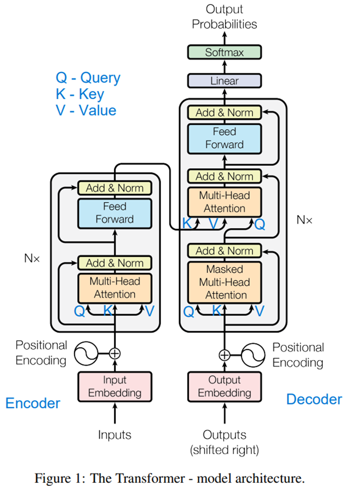

# Transformer-PyTorch

This code is a complete implementation of a ChatBot (sequence-to-sequence task) using the Transformer architecture: a
transformer implemented from scratch and a transformer built from built-in nn.Transformer of a PyTorch deep learning
framework. This Transformer implementation is based on the original paper [Attention is All you Need](https://arxiv.org/abs/1706.03762).

The following transformer architecture is the modified version of the diagram given in the [original paper](https://arxiv.org/abs/1706.03762)
for clarity.




## Installation

Git clone this repo and install dependencies to have the same environment configuration as the one we used. Note that 
we trained it on a single NVIDIA GeForce RTX 2080 Ti GPU.

```
git clone https://github.com/nathanlem1/Transformer-PyTorch
cd Transformer-PyTorch
pip install -r requirements.txt
```

## Train and test 
To train on the sample training set provided in the `chatbot_example.py`, you need to run the following code on terminal:  

```
python chatbot_example.py  --transformer_type from_pytorch --positional_encoding_type sinusoidal
```

Please look into the `chatbot_example.py` for more details. You need to provide the correct `transformer_type` 
(`from_scratch` or `from_pytorch`), `positional_encoding_type` (`sinusoidal` or `learned`), and others if necessary.

## Additional Information
The following links are useful for understanding the Transformer architecture in more details: 
[Link1](https://medium.com/towards-data-science/build-your-own-transformer-from-scratch-using-pytorch-84c850470dcb), 
[Link2](https://medium.com/@bavalpreetsinghh/transformer-from-scratch-using-pytorch-28a5d1b2e033) and 
[Link3](https://medium.com/correll-lab/building-clip-from-scratch-68f6e42d35f4). The example given in 
[here](https://pytorch.org/tutorials/beginner/chatbot_tutorial.html) also gives a good ChatBot tutorial
though it uses RNN (particularly GRU with attention) unlike ours which aims to demonstrate how to implement Transformer
in different ways: from scratch and using built-in PyTorch framework, for ChatBot example.

